# Artium-Gallery — Museum Application
## Initial Design Document

**Version:** 0.1 (Draft)
**Status:** Initial architecture and data model — pending review

---

## 1. Overview

Artium-Gallery is a museum catalog application, structured like a digital art book. Each artifact
is presented with rich descriptive content and linked cross-references to its artist,
period, country, and school — allowing visitors to browse the collection the way they
would move through a physical museum book, following threads between related works.

**Phase 1:** Web application
**Phase 2:** Mobile apps for phone and tablet (iOS/Android), sharing logic with the web
codebase

---

## 2. Core Content Model

### 2.1 Entities

| Entity | Description |
|---|---|
| **Artifact** | A single museum object/artwork. Has a description, a Medium (controlled list), a Location (free text — e.g. current gallery/display location), an optional Collection reference, and links to Artist, Period, and (optionally) School. |
| **Organization** | A museum/institution record. Owns one or more Collections (required, one-to-many) — every Collection belongs to exactly one Organization. |
| **Collection** | A named grouping (e.g. a specific exhibit, donor collection, or curatorial sub-collection), owned by exactly one Organization, that Artifact, Artist, School, Period, or Country records may optionally belong to. Marked `public` or `private` to control catalog visibility; `private` Collections are visible only to Admins and to users explicitly granted access (see Section 2.4.1). |
| **CollectionAccess** | Join table granting a specific staff User `view` or `manage` access to a specific `private` Collection. Admins bypass this check entirely and can always see everything. |
| **Medium** | A controlled vocabulary of materials/techniques (e.g. "oil on canvas," "marble," "bronze"). Any staff role may add a new entry if the one needed doesn't exist yet; entries can be deactivated (not deleted) to retire duplicates. |
| **Artist** | Creator of one or more artifacts. Has an optional embedded portrait image. Links to Country and Period, and optionally to School and Collection. |
| **School** | An artistic school/movement (e.g. "Venetian School"). Has a list of associated Artists, and can also be attached directly to an Artifact when no specific artist is known. May optionally belong to a Collection. |
| **Period** | A historical/artistic period (e.g. "Renaissance"). Has a list of Artists active during it, and is also linked directly from Artifact. May optionally belong to a Collection. |
| **Country** | Country of origin. Has a list of Artists from that country. May optionally belong to a Collection. |
| **Attachment** | A file (image, scan, PDF, etc.) attached to an Artifact. |

### 2.2 Relationships

- `Artifact → Artist` (optional — some artifacts have no known individual creator)
- `Artifact → Period` (required)
- `Artifact → School` (optional, independent of Artist — supports "School: Venetian,
  artist unknown" style attribution)
- `Artifact → Medium` (required, controlled list — see Section 2.6)
- `Artifact → Attachment` (one-to-many)
- `Artifact → Collection` (optional — see Section 2.4)
- `Artist → Country`
- `Artist → Period`
- `Artist → School`
- `Artist → Collection` (optional)
- `School → Collection` (optional)
- `Period → Collection` (optional)
- `Country → Collection` (optional)
- `Organization → Collection` (required, one-to-many — every Collection belongs to exactly
  one Organization; see Section 2.4)
- `Collection → User` (many-to-many, via `CollectionAccess` — grants specific users
  `view`/`manage` access to a `private` Collection; see Section 2.4.1)

This produces a hub-and-spoke browsing pattern: from any Artifact, a visitor can reach
its Artist, Period, or School; from any Artist, Period, School, or Country page, a
visitor sees the list of associated Artifacts/Artists — mirroring how an art reference
book cross-links entries.

### 2.3 Entity-Relationship Diagram


### 2.4 Collections

`Collection` is a named grouping mechanism — distinct from Medium's
controlled-vocabulary pattern (Section 2.6), since a Collection is not a
classification every record must have, but a way to tag a subset of records as
belonging to something like a specific exhibit, a donor's gift, or a curatorial
sub-collection. Unlike Medium, every Collection is owned by exactly one
`Organization` (Section 2.4.1) and, when `private`, is only visible to staff
explicitly granted access (Section 2.4.2).

- Fields: `id` (UUID), `organization_id` (UUID, required FK → `Organization` —
  the owning museum/institution), `collection_name`, `type` (`public` or
  `private`), plus audit fields `created_by_name` (the full name of the staff
  member who created the Collection, stored as text — not a foreign key to
  `User`), `updated_by_name` (the full name of whoever last modified it,
  nullable until a first edit occurs), `created_at`, and `updated_at` (nullable
  until first modified). Further metadata (dates, curator notes) can be added
  later without affecting the reference pattern below.
- `type` is required and constrained to exactly two values: `public` (visible in
  the Vercel-hosted catalog and to anonymous visitors) or `private` (staff-only,
  used for in-progress exhibits, internal groupings, or donor collections not yet
  ready to publish). Defaults to `private` so a newly created Collection isn't
  exposed before a curator explicitly marks it public.
- `created_by_name` and `updated_by_name` are stored as plain text captured at the
  time of the action, rather than referencing `User.id`. This is a deliberate
  denormalization: it keeps a readable historical record even if the staff
  account is later deactivated or renamed, at the cost of no longer being able to
  reliably join back to a live `User` row, and no automatic update if that user's
  name changes later.
- `created_by_name` is required (every Collection is created by a specific staff
  member); `updated_by_name` and `updated_at` remain `NULL` until the Collection is
  edited for the first time, at which point they're set and updated on every
  subsequent edit.
- `Artifact`, `Artist`, `School`, `Period`, and `Country` each carry a **nullable**
  `collection_id`. A record with no collection assigned (`collection_id = NULL`)
  behaves exactly as it does today — Collection is purely additive, not a
  required classification.
- A Collection can span across entity types — for example, an exhibit collection
  could include specific Artifacts, the Artists behind them, and the Period they
  belong to, all tagged with the same `collection_id`, enabling a single "view this
  exhibit" query across otherwise unrelated entity tables.
- No cross-entity referential constraint links these five `collection_id` columns
  to each other beyond sharing the same `Collection.id` — each is an independent,
  optional foreign key.

#### 2.4.1 Organization Ownership

- `Organization` models a museum/institution. Fields: `id` (UUID), `name`
  (required), `description`, `website_url`, `contact_email`, `address` (all
  nullable free text/metadata), and audit fields `created_at`/`updated_at`.
- `Collection.organization_id` is a **required** foreign key — every Collection
  belongs to exactly one Organization; an Organization owns any number of
  Collections (one-to-many). Unlike `collection_id` on Artifact/Artist/School/
  Period/Country, this link has no `NULL` case.
- A single-museum deployment simply has one `Organization` row; the model is
  ready for a multi-museum deployment (e.g. a shared platform hosting several
  institutions' catalogs) without further schema changes.

#### 2.4.2 Private Collection Access (Security)

A `private` Collection (Section 2.4) is not visible to just any logged-in staff
member — visibility is controlled explicitly:

- **Admins always see everything.** Regardless of a Collection's `type` or
  whether any access grant exists, an Admin can view and manage every
  Collection. This check happens first and short-circuits the rest of the
  logic below.
- **Public Collections** (`type = 'public'`) are visible to every staff role and
  to anonymous public-site visitors, same as content with no Collection at all.
- **Private Collections** (`type = 'private'`) are visible only to:
  - the Admin role (see above), and
  - any User with a matching `CollectionAccess` row for that Collection.
- `CollectionAccess` is a join table granting a specific `User` either `view` or
  `manage` access to a specific `private` `Collection`:
  - `view` — can see the Collection and the Artifacts/Artists/etc. tagged to it.
  - `manage` — can also edit the Collection's own metadata and change which
    records are tagged to it. `manage` does not bypass the existing Role
    permission matrix (Section 3.2) — a Contributor granted `manage` access
    still can't publish content, for example; the two systems are additive.
  - Fields: `id` (UUID), `collection_id` (FK → Collection), `user_id` (FK →
    User), `access_level` (`view` or `manage`), `granted_by` (nullable FK →
    User — who granted it), `granted_at` (timestamp). A unique constraint on
    (`collection_id`, `user_id`) means one row per user per Collection; the
    access level is updated in place rather than adding a second row.
- Since Artifact/Artist/School/Period/Country records can be tagged to a
  Collection via their own optional `collection_id`, a record tagged to a
  `private` Collection inherits that Collection's visibility rule — it's hidden
  from the public catalog and from staff without access, exactly as if the
  Collection itself were being viewed directly.
- This is an **application-layer** access-control rule (enforced in the API,
  e.g. as a `WHERE` clause added to every Collection/tagged-record query based
  on the caller's role and `CollectionAccess` grants), not a database-level
  constraint — the schema only stores the grants themselves.

### 2.5 Artist Portrait (Embedded Image — Exception to Section 6 Storage Principle)

Unlike Attachment files (Section 6), which are deliberately kept out of the
database and referenced only by key, the Artist's portrait is stored as an
**embedded binary field directly on the Artist row**. This is a scoped, deliberate
exception, not a change to the Attachment pattern.

- **Fields:** `portrait_image` (`MEDIUMBLOB` — up to 16 MB, sufficient for a single
  portrait photo) and `portrait_content_type` (e.g. `image/jpeg`, `image/png`),
  both nullable. An Artist with no portrait simply has both fields `NULL`.
- **Why embedding is acceptable here specifically:** this is a single, optional
  image per Artist — not a multi-file, multi-variant attachment system. Embedding
  avoids a full upload/storage round-trip for what is otherwise one small field.
- **Serving to the frontend:** because the bytes live in the database rather than
  at a public URL, the portrait cannot be linked directly like a normal ``. The backend must expose a dedicated endpoint (e.g.
  `GET /artists/{id}/portrait`) that reads the row and streams the bytes back with
  the correct `Content-Type` header taken from `portrait_content_type`.
- **Trade-offs accepted with this approach:**
  - Portraits are not CDN-cacheable the way R2-backed images are, unless a
    caching layer is added in front of the endpoint.
  - Database size and backup size grow with the number/size of portraits stored.
  - Deleting an Artist automatically removes its portrait in the same operation,
    with no separate storage cleanup step required — a genuine simplicity win for
    this specific field.
- **If portraits later need multiple sizes, CDN delivery, or bulk import at
  scale,** migrating this single field to the standard Attachment/R2 pattern is a
  contained, well-understood change — it does not require restructuring any other
  part of the data model.

### 2.6 Medium as a Controlled Vocabulary

`Medium` is modeled as its own lookup entity rather than a free-text field on
Artifact, so filtering and reporting by medium stay consistent (avoiding drift like
"Oil on Canvas" vs. "oil paint on canvas" as separate values).

- Any staff role (Admin, Curator, or Contributor) may add a new `Medium` entry
  inline while editing an artifact, if the value they need doesn't already exist.
  This keeps Contributors from being blocked mid-edit waiting on approval.
- Existing entries are never hard-deleted. Admins/Curators can set `is_active =
  false` to retire duplicates or mistakes; retired entries stop appearing as
  selectable options but remain valid for artifacts that already reference them.
- `added_by` tracks who introduced each entry, giving Admins/Curators visibility
  into vocabulary growth without restricting who can contribute to it.

---

## 3. Users, Roles & Permissions

### 3.1 Roles

There is **no public account tier**. The public site is fully anonymous and read-only.
Only staff have logins, via a single shared login page:

| Role | Purpose |
|---|---|
| **Admin** | Full system access, including user/role management |
| **Curator** | Manages and publishes content, approves suggestions and drafts |
| **Contributor** | Creates/edits content as drafts; cannot publish new content unassisted |

### 3.2 Permission Matrix

| Action | Admin | Curator | Contributor | Public (no login) |
|---|:---:|:---:|:---:|:---:|
| View published artifacts | ✅ | ✅ | ✅ | ✅ |
| Suggest a text edit | ✅ | ✅ | ✅ | ✅ |
| Create/edit content (as draft) | ✅ | ✅ | ✅ | ❌ |
| Add a new Medium vocabulary entry | ✅ | ✅ | ✅ | ❌ |
| Deactivate a Medium vocabulary entry | ✅ | ✅ | ❌ | ❌ |
| Publish/approve new content | ✅ | ✅ | ❌ | ❌ |
| Approve/reject public edit suggestions | ✅ | ✅ | ✅ | ❌ |
| Delete content | ✅ | ✅ | ❌ | ❌ |
| Manage users/roles | ✅ | ❌ | ❌ | ❌ |
| View a `public` Collection's contents | ✅ | ✅ | ✅ | ✅ |
| View a `private` Collection's contents | ✅ (always) | Only if granted `view`/`manage` via `CollectionAccess` | Only if granted `view`/`manage` via `CollectionAccess` | ❌ |
| Manage a `private` Collection (metadata, tagged records) | ✅ (always) | Only if granted `manage` via `CollectionAccess` | Only if granted `manage` via `CollectionAccess` | ❌ |
| Grant/revoke `CollectionAccess` | ✅ | ✅ (for Collections they themselves have `manage` on) | ❌ | ❌ |

### 3.3 Public Edit Suggestions (Wiki-style Workflow)

Visitors can propose edits to text fields (e.g. an artifact description) without an
account:

1. **Submit** — a "suggest an edit" control creates an `EDIT_SUGGESTION` row
   (`status = pending`). The live record is untouched. Name/email are optional.
2. **Review** — any staff role (admin, curator, or contributor) can see the pending
   queue and approve or reject.
3. **Approve** — the proposed text is copied into the live field; the suggestion is
   stamped with `reviewed_by` and `reviewed_at`.
4. **Reject** — the suggestion is marked rejected and kept (not deleted) for audit
   trail and spam tracking.

Notes for implementation:
- `entity_type` + `entity_id` is a generic reference so one table covers Artifact,
  Artist, School, Period, and Country — validated in application code since the
  database can't enforce a polymorphic foreign key.
- Rate-limit the public suggestion endpoint (e.g. by IP) from day one — an open,
  no-login text box is a common spam target.

---

## 4. Technology Recommendations

| Layer | Recommendation | Rationale |
|---|---|---|
| Database | PostgreSQL (hosted on **Supabase**) | Relational model fits fixed, shallow relationships; built-in full-text search |
| File/media storage | Cloudflare R2 or Amazon S3 + CDN | Object storage for images/attachments; R2 avoids egress fees |
| Backend | Custom API — NestJS + Prisma | Full schema control and clean support for the custom suggestion-moderation workflow (see Section 3.3) |
| API style | GraphQL | Lets frontend fetch an Artifact + Artist + Country + Period in one request |
| Web frontend | React + Next.js | SEO-friendly, built-in image optimization |
| Future mobile | React Native | Shares business logic and API client with the web React codebase |
| Auth | JWT-based sessions, bcrypt/argon2 password hashing | Standard, stateless, works cleanly with role-based middleware checks |

**Two-surface architecture:**
- **Public site/app** — unauthenticated, read-only, only fetches `status = published`
  records. This is what the future mobile app talks to as well.
- **Staff admin panel** — separate route/subdomain, gated by shared staff login,
  handles drafts, publishing, user management, and the suggestion review queue.

---

## 5. Frontend Composition (Wix + Vercel)

The public-facing frontend is deliberately split across two properties rather than
rebuilt as a single app, since an existing Wix site already serves the institution's
static/marketing content well.

- **Wix** (existing site, unchanged) — hosts static, low-change pages: Home, About,
  Visit, Contact, hours, etc. No code changes are required on the Wix side; this
  remains exactly as it is today.
- **Vercel (Next.js)** — hosts the dynamic catalog experience: Artifact, Artist,
  Period, School, and Country pages, all pulling live data from the NestJS API and,
  through it, Supabase and Cloudflare R2, per the architecture in Section 4.

```
wix-site.com  (Wix — existing static pages: Home, About, Visit, Contact)
      │
      │  link: "Explore the Collection" →
      ▼
artium-gallery.vercel.app  (Next.js on Vercel — dynamic catalog)
      │  calls API
      ▼
NestJS API (Railway) → Supabase (data) + Cloudflare R2 (images)
```

**Integration points:**
- The Wix site adds a standard navigation link/button (e.g. "Explore the
  Collection") pointing to the Vercel-hosted catalog. This uses Wix's own editor —
  no Velo/custom code is required.
- **Domain cohesion:** rather than sending visitors from `wix-site.com` to an
  unrelated `*.vercel.app` URL, the catalog app should be attached to a subdomain of
  the existing domain (e.g. `catalog.artiumgallery.com` or
  `explore.artiumgallery.com`), pointed at Vercel via DNS. This keeps the experience
  feeling like one site rather than two. Worth doing once past initial testing,
  not necessarily on day one.
- **No shared backend dependency for Wix** — Wix does not call the NestJS API or
  touch the database; it is purely a static, independent front door. This keeps the
  integration surface minimal and avoids introducing Wix as a point of failure for
  the catalog itself.
- **Cost impact:** none. Wix's subscription is separate and pre-existing; nothing in
  the cost estimate in the Deployment Environments document changes as a result of
  this split.

---

## 6. Storage Architecture

**Principle:** the file system (object storage) is used *only* for binary media —
pictures, documents, and future mobile assets. Every structured record — Artifact,
Artist, School, Period, Country, User, Role, EditSuggestion, and even Attachment
*metadata* — lives in PostgreSQL. Object storage never stores anything queryable or
relational; the database never stores raw bytes.

### 6.1 Backend approach

Custom backend (NestJS + Prisma + GraphQL, backed by PostgreSQL), chosen over a
headless CMS (Strapi/Directus) for full control over the schema and the custom
suggestion-moderation workflow (Section 3.3), which doesn't map cleanly onto standard
CMS content types.

### 6.2 Object storage layout

Provider: Cloudflare R2 or Amazon S3, fronted by a CDN.

```
artium-gallery-media/
├── artifacts/
│   └── {artifact_id}/
│       ├── originals/
│       │   └── {attachment_id}.{ext}       # full-res image, PDF, scan
│       └── derived/
│           ├── {attachment_id}_thumb.webp   # generated on upload
│           └── {attachment_id}_medium.webp
│
├── artists/
│   └── {artist_id}/
│       └── portrait.{ext}                   # optional artist photo/portrait
│
├── staff-uploads/
│   └── {user_id}/tmp/                       # transient, pre-attachment staging
│
└── mobile/
    ├── offline-bundles/
    │   └── {bundle_version}/                # pre-packaged catalog subsets for offline browsing
    ├── app-assets/
    │   └── {platform}/{version}/            # icons, splash screens, config JSON per app release
    └── push-media/
        └── {campaign_id}/                   # images used in mobile push notifications
```

The `mobile/` prefix is reserved now, ahead of Phase 2, so mobile-specific storage
needs (offline bundles for spotty-connectivity gallery visits, per-platform asset
packs, push notification media) don't collide with or require retrofitting the
artifact/artist media structure later. The key-naming scheme stays stable across both
phases.

**Organizing rules behind this structure:**

1. **Ownership drives the top-level folders** — `artifacts/`, `artists/`,
   `staff-uploads/`, `mobile/`. Each maps to who/what the content belongs to, not to
   file type.
2. **`originals/` vs. `derived/`** exists only under `artifacts/` — the one place
   with meaningful volume and multiple size variants worth generating. Artist
   portraits are simple enough not to need it.
3. **`staff-uploads/tmp/`** is deliberately separate from `originals/` — it holds
   files mid-upload, before the database confirms the attachment (Section 6.3, step
   2 vs. step 3). This keeps half-finished uploads from ever appearing as real
   content.
4. **`mobile/`** is namespaced apart from everything else so Phase 2 additions never
   collide with or require restructuring Phase 1 folders.
5. **Every path is deterministic from IDs already in Postgres** (`artifact_id`,
   `artist_id`, `user_id`) — nothing in this structure needs its own lookup table;
   the database foreign key is the only source of truth for which folder a file
   belongs to.

### 6.3 Upload flow

1. Client (staff admin panel, or later the mobile app) requests a signed upload URL
   from the API.
2. Client uploads the file bytes directly to object storage — the app server never
   proxies binary data.
3. On completion, the API writes only the resulting `storage_key` into the
   `Attachment` table (or, in Phase 2, an equivalent mobile-asset table). The database
   is never touched with raw bytes, only the reference.

This pattern is identical for artifact images today and for mobile bundles/assets in
Phase 2 — nothing about the flow needs to change when the mobile phase begins.

---

## 7. Deployment Environments

### 7.1 Services Overview

| Environment | Service | Purpose | Dashboard URL |
|---|---|---|---|
| Static marketing pages | **Wix** (existing) | Home, About, Visit, Contact — unchanged from current site | (existing Wix account) |
| Database | **Supabase** | Hosts PostgreSQL — all structured data | https://app.supabase.com |
| File storage | Cloudflare R2 | Hosts binary files (images, scans, docs) | https://dash.cloudflare.com |
| Backend hosting | **Railway** (recommended) | Runs the NestJS API | https://railway.app |
| Frontend hosting (catalog) | Vercel | Runs the dynamic Next.js catalog app | https://vercel.com |
| Source control | GitHub | Code repository; triggers deploys | https://github.com |
| Domain (optional) | Cloudflare or Namecheap | Custom domain, DNS — used to attach a catalog subdomain to the existing Wix domain | https://dash.cloudflare.com |

### 7.2 URL Reference

**Static marketing pages (Wix — existing, unchanged)**
- No new setup required. The only change is adding a navigation link/button (e.g.
  "Explore the Collection") pointing to the Vercel-hosted catalog, done through
  Wix's own editor.

**Database (Supabase)**
- Dashboard: `https://app.supabase.com`
- Connection string (not a browsable URL — used as `DATABASE_URL` in the backend):
  ```
  postgresql://postgres:<password>@db.<project-ref>.supabase.co:5432/postgres
  ```
- Supabase also exposes an auto-generated REST/GraphQL API and a browser-based
  table editor, useful for quick manual inspection during development — though the
  application itself talks to Postgres through Prisma, not Supabase's generated API.

**File storage (Cloudflare R2)**
- Dashboard: `https://dash.cloudflare.com`
- API endpoint (used as `STORAGE_ENDPOINT` in `storage.provider.ts`):
  ```
  https://<account-id>.r2.cloudflarestorage.com
  ```
- Public file URL, once the bucket has public access or a custom domain attached:
  ```
  https://media.artiumgallery.com/artifacts/{artifact_id}/originals/{file}
  ```
  or the free default `https://<bucket>.r2.dev/...` for early testing.

**Backend API (Railway — recommended)**
- Dashboard: `https://railway.app`
- Auto-generated deployment URL, e.g.:
  ```
  https://artium-gallery-api.up.railway.app
  ```
- **Why Railway over Render:** Render's free tier spins services down after ~15
  minutes of inactivity, adding a 30–60+ second cold-start delay on the next
  request. Railway has no equivalent cold-start penalty and offers a simpler
  first-deploy experience, at the cost of eventually requiring a card once usage
  exceeds the free credit — an acceptable tradeoff once the app has real usage
  worth paying for. Render remains a fallback if avoiding any card entry is a hard
  requirement.

**Frontend catalog app (Vercel)**
- Dashboard: `https://vercel.com`
- Auto-generated deployment URL, e.g.:
  ```
  https://artium-gallery.vercel.app
  ```
- Recommended to attach to a subdomain of the existing Wix domain once past initial
  testing (e.g. `catalog.artiumgallery.com`), rather than leaving visitors on the
  unrelated `*.vercel.app` URL — see Section 5.

### 7.3 How the Pieces Connect

```
wix-site.com  (Wix — existing static pages: Home, About, Visit, Contact)
      │
      │  link: "Explore the Collection" →
      ▼
https://artium-gallery.vercel.app        (Next.js — Vercel)
      │  calls API
      ▼
https://artium-gallery-api.up.railway.app (NestJS — Railway)
      │                                    │
      ▼                                    ▼
Supabase Postgres                  Cloudflare R2
(structured data)                  (images/files)
```

### 7.4 Dev vs. Production Split

Two full environments are recommended from early on rather than a single shared
one, to avoid risking real content while testing:

| | Development | Production |
|---|---|---|
| Database | Separate Supabase project (or a branch, if using Supabase branching) | Separate Supabase project |
| R2 bucket | `artium-gallery-media-dev` | `artium-gallery-media-prod` |
| Backend URL | `artium-gallery-api-dev.up.railway.app` | `artium-gallery-api.up.railway.app` |
| Frontend URL | Vercel's automatic per-branch preview URLs | `artium-gallery.vercel.app` (or catalog subdomain) |
| Wix | Not applicable — Wix site is unchanged in both environments; only the link target (dev vs. prod catalog URL) would differ if testing the integration | Live link points to the production catalog URL |

### 7.5 Environment Variables

```
DATABASE_URL=postgresql://postgres:<password>@db.<project-ref>.supabase.co:5432/postgres
STORAGE_ENDPOINT=https://<account-id>.r2.cloudflarestorage.com
STORAGE_ACCESS_KEY=...
STORAGE_SECRET_KEY=...
MEDIA_BUCKET=artium-gallery-media-dev   # or -prod
JWT_SECRET=...
```

These are set per-environment (development vs. production) in each hosting
provider's dashboard (Railway/Render for the backend, Vercel for any
frontend-exposed public config) — never committed to the repository.

---

## 8. Private Deployment Variant

Alongside the cloud deployment (Supabase + Cloudflare R2), a fully self-hosted
**private** variant is supported for running Artium-Gallery on personal
infrastructure, with zero dependency on the cloud accounts used in Section 7.

### 8.1 Private Database: MySQL

- **Provider change:** `schema.prisma` switches `provider = "postgresql"` to
  `provider = "mysql"`. This is a one-line change plus re-running `prisma migrate
  dev` to regenerate migrations against MySQL's dialect.
- **Data model is unaffected** — Artifact, Artist, Period, Country, School, Medium,
  User, Role, and EditSuggestion, along with all foreign keys and nullability rules
  defined in Section 2, work identically under MySQL.
- **Feature differences to account for:**
  - Full-text search uses MySQL's `FULLTEXT` index type rather than Postgres's
    `tsvector` — functionally similar, different tuning characteristics.
  - UUID generation is normally handled at the Prisma/application layer
    (`@default(uuid())`), so this is largely a non-issue regardless of engine.
  - JSON columns are supported by both engines, with minor syntax differences
    abstracted away by Prisma.
- **Hosting:** run MySQL locally or, more robustly, in Docker on the private
  machine — this simplifies backup/restore and keeps the engine version
  consistent.

### 8.2 Private File Storage: MinIO

- **MinIO** is a self-hosted, open-source object storage server that implements
  the same S3-compatible API as Cloudflare R2/Amazon S3.
- **No code changes required** — `storage-provider.ts` (Section 6) is already
  written against the S3-compatible API (`S3Client`, `PutObjectCommand`, signed
  URLs); only `STORAGE_ENDPOINT` and credentials change to point at the private
  MinIO instance.
- **The same folder structure applies unchanged** (`artifacts/{id}/originals/`,
  `artists/{id}/`, etc.) since that structure is plain S3 key naming, not anything
  R2-specific.
- **Runs in Docker:**
  ```
  docker run -p 9000:9000 -p 9001:9001 \
    -v /path/on/disk:/data \
    minio/minio server /data --console-address ":9001"
  ```
- Includes a web console (port 9001) for browsing files directly, comparable to
  the R2 dashboard.

### 8.3 Isolation Model

| | Cloud deployment | Private deployment |
|---|---|---|
| Database | Supabase (Postgres) | MySQL, local/Docker |
| File storage | Cloudflare R2 | MinIO, local/Docker |
| Data overlap | None — fully independent | None — fully independent |

The two stacks share only the application codebase (backend/frontend source), never
any data, credentials, or running infrastructure. This is the same isolation model
used when duplicating the application for a separate organization (Section 8.4) —
a private deployment is effectively another such clone, using self-hosted engines
in place of managed cloud ones.

### 8.4 Duplicating the Application for Another Organization

The backend was deliberately built as a generic API over the core entities rather
than tightly coupled to any specific frontend, which makes full duplication for a
separate, fully independent user straightforward:

| Component | For a new, independent deployment |
|---|---|
| Code repo | Forked/copied — same NestJS backend, same Prisma schema |
| Database | New database instance (cloud or private/MySQL) — own data from day one |
| File storage | New storage instance (R2 or private/MinIO) — own credentials |
| Backend hosting | New Railway (or private host) deployment — own URL, own bill |
| Frontend | The only piece expected to genuinely differ — own custom UI/branding |
| Domain | Own domain |

Any new frontend only needs to speak the same API contract (endpoints, field
shapes, auth flow) — it can look completely different, use a different framework,
and carry entirely different branding.

**Making this repeatable rather than a one-off copy-paste:**
1. Parameterize anything hardcoded (bucket names, API URLs, branding strings) into
   environment variables, so a new instance is "set new env vars and deploy."
2. Maintain a `SETUP.md` documenting the concrete provisioning steps.
3. Keep frontend and backend as genuinely separate repos/deployments, so swapping
   the frontend for something different doesn't require untangling shared code.

**Automation options, roughly in order of effort:**
- **Scaffolding script** — clones the repo and replaces placeholder values in one
  command.
- **CLI-driven provisioning** — a script calling each platform's CLI in sequence
  (Supabase CLI, Railway CLI, Wrangler for Cloudflare, Vercel CLI) to provision
  resources, prompting only for values that must be human-provided.
- **Infrastructure as Code (Terraform)** — the most robust option; defines all
  resources declaratively, so `terraform apply` with a new `.tfvars` file
  provisions an entire environment in one step.
- **Realistic limit:** account creation, payment details, and domain/DNS
  delegation on each platform remain manual steps regardless of automation tier.

---

## 9. Institutional Hosting — Cloning the Existing Cloud Architecture

Where Section 8 covers a self-hosted **private** variant (MySQL/MinIO), this
section covers the complementary case: standing up a new, fully independent
instance of the **existing cloud architecture** — Supabase, Cloudflare R2, static
web pages, and the Vercel catalog layer — for a separate institution that wants
managed cloud hosting rather than self-hosting.

This is the same underlying duplication model as Section 8.4, applied specifically
to the cloud stack, layer by layer.

### 9.1 Database Layer (Supabase)

- Create a **new, separate Supabase project** for the institution — never a
  shared project with row-level tenant filtering. Full data isolation, matching
  the isolation principle in Section 8.3.
- Run the same Prisma schema/migrations against the new project
  (`prisma migrate deploy`) to stand up an identical, empty structure.
- The institution receives its own connection string and Supabase dashboard
  access — no visibility into any other institution's data.

### 9.2 Storage Layer (Cloudflare R2)

- Create a **new R2 bucket** per institution (e.g. `<institution>-media`),
  following the same key layout defined in Section 6.2 (`artifacts/`, `artists/`,
  `staff-uploads/`, `mobile/`).
- Issue separate API credentials scoped to that bucket only, so one
  institution's backend can never read or write another's files.
- Optionally attach a per-institution custom domain for serving media
  (`media.<institution-domain>.com`), consistent with the CDN approach already
  in place.

### 9.3 Static Web Pages Layer

- Each institution brings or builds its own static marketing pages (its own Wix
  site, or its own S3 + CloudFront deployment, per the pattern discussed for
  Artium-Gallery's own static pages).
- This layer is intentionally the most independent — an institution may choose
  Wix, a static host, or something else entirely, since it never talks to the
  shared backend directly (see Section 5).
- The only integration point is the outbound link/button to that institution's
  own catalog subdomain, exactly as designed for Artium-Gallery itself.

### 9.4 Dynamic Catalog Layer (Vercel)

- Create a **new Vercel project** per institution, deployed from either a forked
  copy of the frontend repo or the same repo with institution-specific
  environment variables (branding, API URL, theming).
- Point the new project's `NEXT_PUBLIC_API_URL` (or equivalent) at that
  institution's own backend deployment (Section 9.5) — never shared across
  institutions.
- Attach the institution's own subdomain (e.g. `catalog.institution.com`),
  following the domain-cohesion approach in Section 5.

### 9.5 Backend/API Layer (Railway)

- Create a **new Railway service** per institution, deployed from the same
  backend codebase, with environment variables pointing at that institution's
  own Supabase project and R2 bucket (Sections 9.1–9.2).
- No backend instance ever holds credentials for more than one institution's
  database or storage — this keeps a misconfiguration or compromise in one
  institution's deployment from being able to reach another's.

### 9.6 Summary Table

| Layer | Per-institution resource | Shared across institutions? |
|---|---|---|
| Database | New Supabase project | Never |
| File storage | New R2 bucket + credentials | Never |
| Static web pages | Institution's own site (Wix, S3, or other) | Never |
| Dynamic catalog | New Vercel project | Never |
| Backend/API | New Railway service | Never |
| Application codebase | Forked/shared repo | Yes — this is the only shared artifact |

As in Section 8.4, the only thing every institutional deployment has in common is
the **codebase** — never running infrastructure, credentials, or data. This keeps
institutional hosting a straightforward repeat of the same four-layer cloud setup
already proven for Artium-Gallery itself, rather than a new architecture to design
per customer.

---

## 10. Open Questions / Next Steps

- [ ] Define which content types (beyond text descriptions) can receive public
      suggestions — e.g. can visitors suggest new Attachments, or only text edits?
- [ ] Decide on image/attachment size limits and accepted file types
- [ ] Define notification behavior for contributors when their suggestion is
      approved/rejected (requires capturing submitter email)
- [ ] Finalize hosting/infra provider for Phase 1 launch

---

## Appendix A: Data Model Reference

Full field-by-field listing for every entity, complementing the ERD in Section
2.3. Types are shown in Prisma/logical form; the equivalent PostgreSQL or MySQL
column type is noted where it differs materially (e.g. `Bytes` → `MEDIUMBLOB`).

### A.0 Full Entity-Relationship Diagram

The complete combined diagram, identical to Section 2.3, reproduced here so the
appendix is self-contained. Per-entity mini diagrams follow in A.1–A.11, each
showing just that entity's immediate relationships.

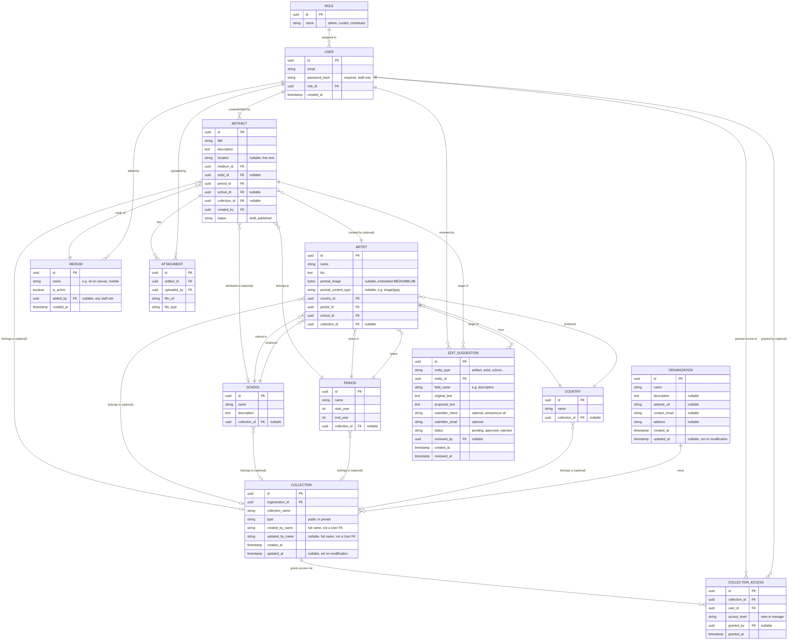

Raw diagram source (for editing/regenerating):

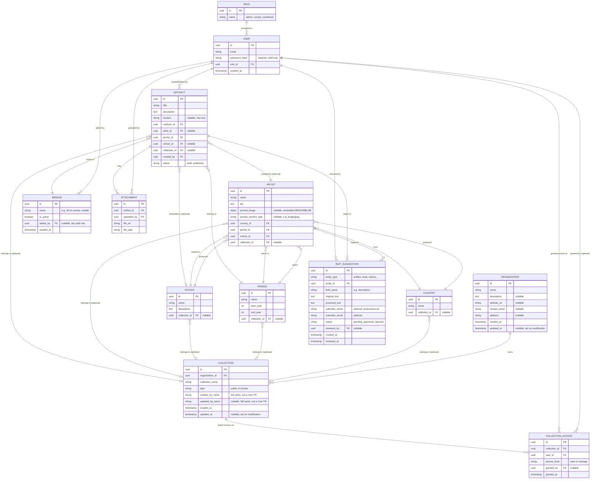

### A.1 Collection

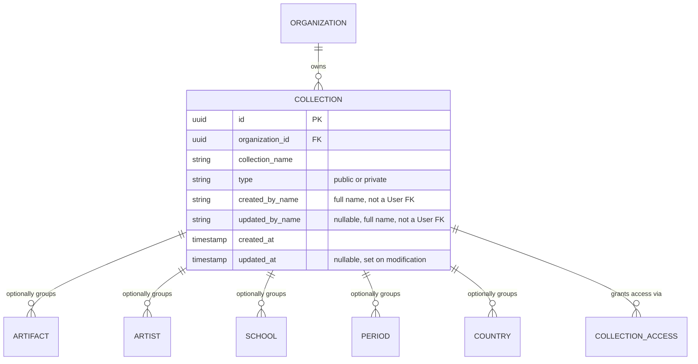

| Field | Type | Nullable | Description |
|---|---|---|---|
| id | UUID (PK) | No | Primary key |
| organization_id | UUID (FK → Organization) | No | Owning museum/institution — every Collection belongs to exactly one Organization |
| collection_name | String | No | Name of the collection/exhibit/grouping |
| type | String | No | `public` or `private` — controls whether the collection is visible in the public catalog |
| created_by_name | String | No | Full name of the staff member who created the Collection, captured as text at creation time — not a foreign key to `User` |
| updated_by_name | String | Yes | Full name of whoever last modified it; `NULL` until first edit |
| created_at | Timestamp | No | Creation time |
| updated_at | Timestamp | Yes | Last modification time; `NULL` until first edit |

### A.2 Artifact

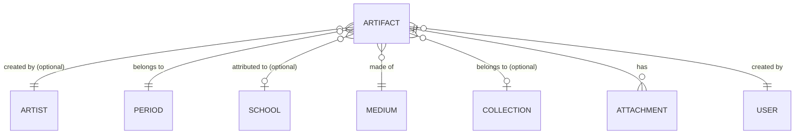

| Field | Type | Nullable | Description |
|---|---|---|---|
| id | UUID (PK) | No | Primary key |
| title | String | No | Artifact title |
| description | Text | No | Curatorial description |
| location | String | Yes | Free text — e.g. current gallery/display location |
| medium_id | UUID (FK → Medium) | No | Controlled-vocabulary medium |
| artist_id | UUID (FK → Artist) | Yes | Creator, if known |
| period_id | UUID (FK → Period) | No | Historical/artistic period |
| school_id | UUID (FK → School) | Yes | Direct school attribution, independent of Artist |
| collection_id | UUID (FK → Collection) | Yes | Optional grouping (exhibit, donor collection, etc.) |
| created_by | UUID (FK → User) | No | Staff member who created the record |
| status | String | No | `draft` or `published` |

### A.3 Artist

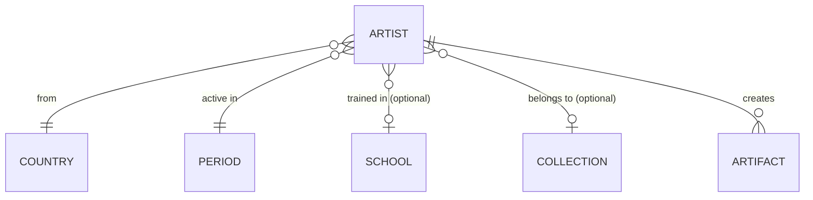

| Field | Type | Nullable | Description |
|---|---|---|---|
| id | UUID (PK) | No | Primary key |
| name | String | No | Artist's name |
| bio | Text | No | Biography |
| portrait_image | Bytes (`MEDIUMBLOB`) | Yes | Embedded portrait image — see Section 2.5 |
| portrait_content_type | String | Yes | e.g. `image/jpeg`; required to serve `portrait_image` correctly |
| country_id | UUID (FK → Country) | No | Country of origin |
| period_id | UUID (FK → Period) | No | Period the artist was active in |
| school_id | UUID (FK → School) | Yes | Artistic school, if applicable |
| collection_id | UUID (FK → Collection) | Yes | Optional grouping |

### A.4 School

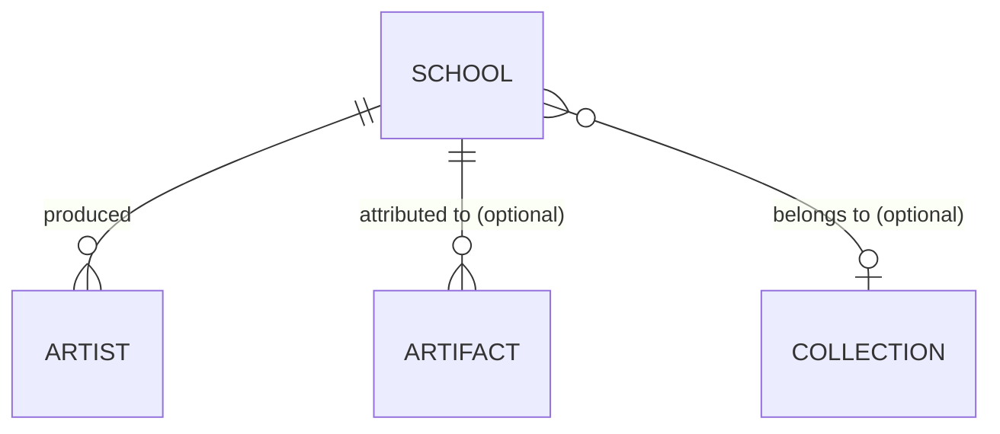

| Field | Type | Nullable | Description |
|---|---|---|---|
| id | UUID (PK) | No | Primary key |
| name | String | No | School/movement name |
| description | Text | No | Description of the school |
| collection_id | UUID (FK → Collection) | Yes | Optional grouping |

### A.5 Period


| Field | Type | Nullable | Description |
|---|---|---|---|
| id | UUID (PK) | No | Primary key |
| name | String | No | Period name (e.g. "Renaissance") |
| start_year | Integer | No | Approximate start year |
| end_year | Integer | No | Approximate end year |
| collection_id | UUID (FK → Collection) | Yes | Optional grouping |

### A.6 Country

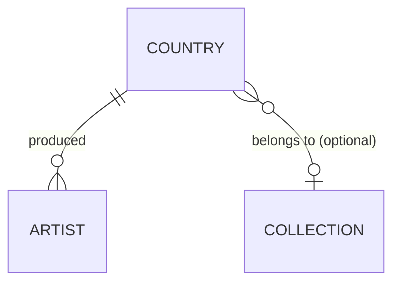

| Field | Type | Nullable | Description |
|---|---|---|---|
| id | UUID (PK) | No | Primary key |
| name | String | No | Country name |
| collection_id | UUID (FK → Collection) | Yes | Optional grouping |

### A.7 Medium

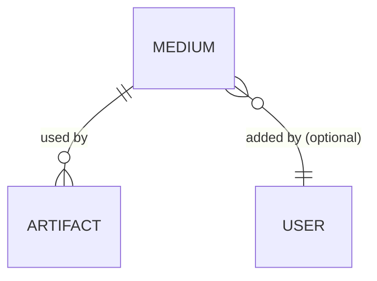

| Field | Type | Nullable | Description |
|---|---|---|---|
| id | UUID (PK) | No | Primary key |
| name | String | No | e.g. "oil on canvas," "marble" |
| is_active | Boolean | No | `false` retires a duplicate/mistaken entry without deleting it |
| added_by | UUID (FK → User) | Yes | Staff member who added this entry (any role) |
| created_at | Timestamp | No | Creation time |

### A.8 Attachment

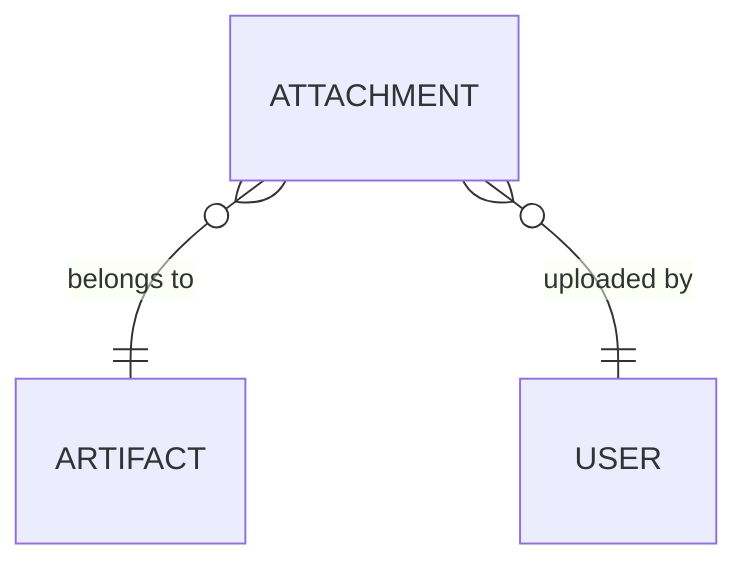

| Field | Type | Nullable | Description |
|---|---|---|---|
| id | UUID (PK) | No | Primary key |
| artifact_id | UUID (FK → Artifact) | No | Parent artifact |
| uploaded_by | UUID (FK → User) | No | Staff member who uploaded the file |
| file_url | String | No | Object storage key (R2/S3/MinIO), not raw bytes |
| file_type | String | No | MIME type of the file |

### A.9 User

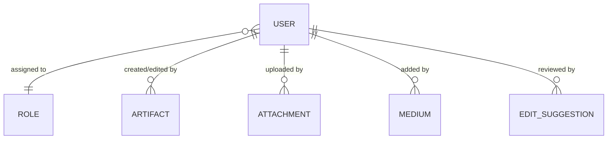

| Field | Type | Nullable | Description |
|---|---|---|---|
| id | UUID (PK) | No | Primary key |
| email | String | No | Staff login email |
| password_hash | String | No | bcrypt/argon2 hash; staff-only, never plaintext |
| role_id | UUID (FK → Role) | No | Assigned role |
| created_at | Timestamp | No | Account creation time |

### A.10 Role

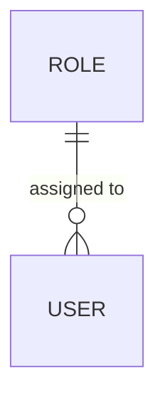

| Field | Type | Nullable | Description |
|---|---|---|---|
| id | UUID (PK) | No | Primary key |
| name | String | No | `admin`, `curator`, or `contributor` |

### A.11 EditSuggestion

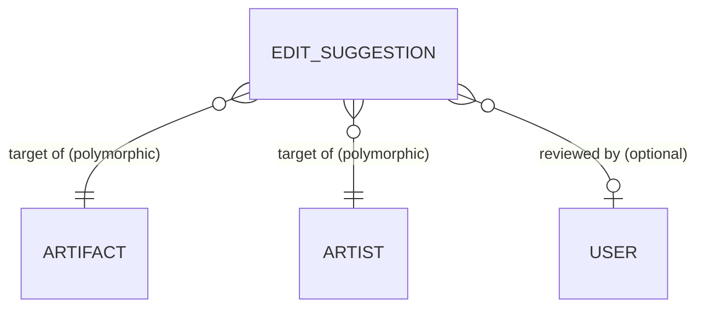


| Field | Type | Nullable | Description |
|---|---|---|---|
| id | UUID (PK) | No | Primary key |
| entity_type | String | No | Target entity, e.g. `artifact`, `artist`, `school` |
| entity_id | UUID (generic reference) | No | Target record's ID — validated in application code, not a true FK |
| field_name | String | No | Which field is being suggested for change, e.g. `description` |
| original_text | Text | No | Snapshot of the field's value at submission time |
| proposed_text | Text | No | Suggested new value |
| submitter_name | String | Yes | Optional — anonymous submission allowed |
| submitter_email | String | Yes | Optional — used for approval/rejection notification if provided |
| status | String | No | `pending`, `approved`, or `rejected` |
| reviewed_by | UUID (FK → User) | Yes | Staff member who reviewed it, once actioned |
| created_at | Timestamp | No | Submission time |
| reviewed_at | Timestamp | Yes | Review time, once actioned |

### A.12 Organization

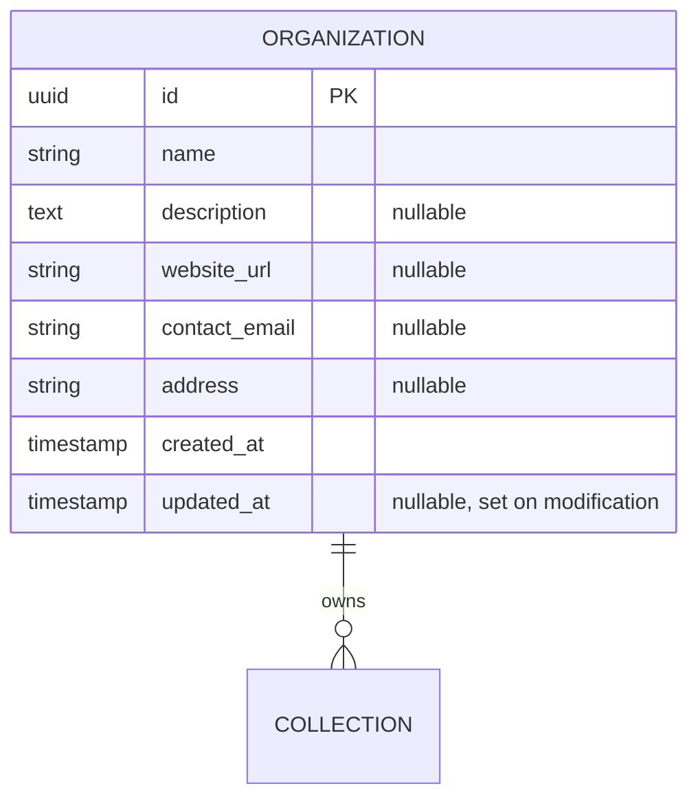

| Field | Type | Nullable | Description |
|---|---|---|---|
| id | UUID (PK) | No | Primary key |
| name | String | No | Museum/institution name |
| description | Text | Yes | About the museum |
| website_url | String | Yes | Public website |
| contact_email | String | Yes | General contact address |
| address | String | Yes | Physical/mailing address |
| created_at | Timestamp | No | Creation time |
| updated_at | Timestamp | Yes | Last modification time; `NULL` until first edit |

### A.13 CollectionAccess

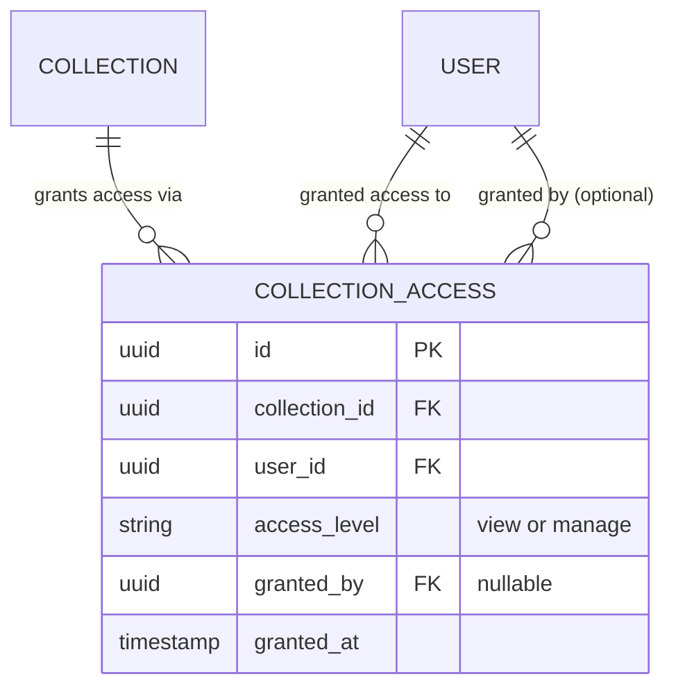

| Field | Type | Nullable | Description |
|---|---|---|---|
| id | UUID (PK) | No | Primary key |
| collection_id | UUID (FK → Collection) | No | The `private` Collection being granted access to |
| user_id | UUID (FK → User) | No | The staff member granted access |
| access_level | String | No | `view` or `manage` — see Section 2.4.2 |
| granted_by | UUID (FK → User) | Yes | Staff member who made the grant, if known |
| granted_at | Timestamp | No | When the grant was made |

Note: a unique constraint on (`collection_id`, `user_id`) ensures at most one
grant row per user per Collection — re-granting updates `access_level` in place
rather than inserting a second row.
